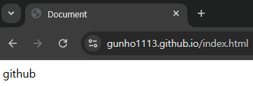

# 202130418 유건호

## 1127



`$ git push -u origin main`

`$ git remote -v`

- origin등록을 확인

```js
<div>
  <Link href="/"> io home </Link>
  <Link href="/test"> test </Link>
  <Link href="/foo"> foo home </Link>
  <Link href="/foo/about"> about </Link>
</div>
```

## 1120

### use client

```
서버컴포넌트와 클라이언트 컴포넌트를 구분하기 위해 사용
```

- 서버에서 렌더링하도록 설계되어, 클라이언트에서만 필요한 컴포넌트를 명시적으로 지정해야 할 필요가 있음
- use client를 컴포넌트 상단에 선언하면 해당 컴포넌트는 클라이언트에서만 렌더링되어, 주로 상태 관리나 브라우저 전용 api 사용이 필요한 경우에 사용됨

### 디렉터리 구조

- app : Routing page 관리
- components : 재사용가능한 공통 컴포넌트 관리
- context : context 컴포넌트 관리
- features : 기능별 컴포넌트 관리
- store : Redux store 설정 파일 관리
- styles : css, sass등 스타일 관리

### context api vs Redux

단점

- 복잡한 상태 관리에 한계 : 상태가 복잡하거나 다양한 액션을 통해 변경이 이루어져야 하는 경우, 관리가 어려워 질 수 있다.
- 성능문제 : 상태가 업데이트되면 해당 상태를 사영하는 모든 하위 컴포넌트가 다시 렌더링 되므로, 상태 범위가 넓을 경우 성능에 영향을 미칠 수 있다.

redux

- redux는 전영 상태를 관리하기 위한 독립적인 state 관리 라이브러리
- 상태의 변경을 예측 가능하게 하고, 전역 state 관리를 더 구조적으로 지원
- store,reducer,action 등의 개념을 사용해 state와 state dispatch를 관리함

장점

- 명확한 상태 관리 구조 : 액션과 reducer를 통해 state dispatch를 과정을 예측 가능하게 만들고, 코드의 가독성을 높인다
- 미들웨어 지원 : redux-thunk, redux-sage와 같은 미들웨오를 사용해 비동기 로직을 쉽게 처리가능함
- 디버깅 도구 : Redux devtools를 통해 상태 변화 및 디버깅이 용이함
- 모든 프레임워크와 호환 : react뿐만 아니라 다른 자바스크립트 프에임워크와도 함께 사용 가능함

단점

- 설정 코드 복잡도 : Context pai에 비해 설정이 복잡하며, boilerplate 코드가 많이 필요함
- 추가 라이브러리 필요 : redux 자체가 외부 라이브러리이므로 설치 및 유기 관리가 필요함
- 작은 애플리케이션에는 과한 설정 : 단순한 상태 관리가 필요한 작은 애플리케이션에서는 과도한 설정일 수 있다

`npm install @reduxjs/toolkit react-redux`

```js createSlice.jsx
import { createSlice } from "@reduxjs/toolkit";

export const countetSlice = createSlice({
  name: "counter",
  initialState: {
    value: 0,
  },
  reducers: {
    increment: (state) => {
      state.value += 1;
    },
    decrement: (state) => {
      state.value -= 1;
    },
  },
});
```

## 1113

### Props 흐름의 이해

- nextjs의 데이터 흐름은 단방향으로 이루어 짐
- 즉,parents에서 child component의 방향으로 props의 흐름이 이루어짐
- 따라서 계층 구조가 복잡해 지면 props driling 문제가 생김
- props driling은 여러 개의 component를 지나 props가 전달 되면서 발생하는 문제

```js
import ComponentA from "../components/ui/ComponentA";
export default function PropsFlow() {
  return (
    <>
      <h1>
        Propos Flow
        <ComponentA />
      </h1>
    </>
  );
}
```

### Context API

- context는 ux 구축에 많이 사용되는 React의 기능이다
- React는 16.3버전 부터 정식적으로 context api를 지원함
- 일반적으로 props는 부모에서 자식으로 전달 되는 단방향 통신을 한다
- context Api는 특정 component가 props를 사용하지 않고, 하위 component를 포함한 모든 component에 데이터를 공유할 수 있는 기능을 제공함

## 1106

### UI 프레임 워크

#### Tailwind CSS

- 다른 프레임워크랑 다르게 css 규칙만 제공
- 자바스크립트 모듈이나 리액트 컴포넌트를 제공하지 않기 때문에 필요한 경우 직적 만들어야함
- 변수값을 조정하여 개성있는 디자인을 만들 수 있다 (자유도 높음)
- dark mode 및 light mode를 쉽게 적용 가능
- 빌드 시점을 사용하지 않는 클래스는 제거 되기 때문에 높은 수준의 최적화를 지원함

### Headless Ui

- TailwindCSS를 만든 Tailwind Labs 팀의 무료 오픈 소스 프로젝트
- TailwindCSS는 모달이나 버튼 등 동적인 컴포넌트를 만들려면 직접 자바 스크립트 코드를 작성해야하지만 이러한 단점을 보완하기 위해 Headless UI가 만들어짐
- Headless Ui는 CSS 클래스를 제공하는 것이 아니라 동적 컴포넌트만 제공

## 1030

### CSS와 내장 스타일링 메서드

### Styled JSX

```jsx Styled.jsx
export default function StyledJsx() {
  return (
    <>
      <button className="button">Styled JSX</button>
      <style jsx>
        {`
          .button {
            padding: 1em;
            border-radius: 1em;
            background: green;
            coloer: white;
          }
        `}
      </style>
    </>
  );
}
```

- styled jsx는 css-in-js 라이브러이며 내장 모듈이기 때문에 설치가 필요 없음
  css 속성 지정을 위해 자바스크립트를 사용할 수 있는 라이브러리임

---

- css-in-js의 단점
- IDE나 코드 편집기 등 개발 도구에 대한 지원이 부족함
- 문법 하이라이팅, 자동 완성, 린트기능을 제공하지 않음
- 코드내에서 css에 대한 의존성이 점점 커져 앱 번들도 커지고 느려짐
- 서버에 미리 css를 설정해도 클라이언트에서 리엑트 하이드레이션이 끝나면 css를 다시 생성해야함
- 이 때문에 실행 시점에 부화가 커지며 웹 앱이 느려짐

### CSS Module

- css-in-js의 단점을 회피하는 방법은 css module 이다.

```js page.js
import Image from "next/image";
import styles from "./page.module.css";

export default function Home() {
  return (
    <>
      <div className={foo.maine}>
        <h1>Home</h1>
      </div>
    </>
  );
}
```

- .module.css로 끝나는 파일에서 css 클래스를 가지고온다
- Home.module.css 파일은 일반적인 css파일이지면 css module이 그 내용을 자바스크립트 객체로 변환함
- 변환한 객체에서 모든 키는 클래스 이름을 가리킨다

### SASS

```css foo.module.scss
$woo: red;

.bar {
  font: 500;
  color: $woo;
}
```

## 1025

### 클라이언트에서 REST API 사용하기

- getServerSideProps나 getStaticProps함수 내에서 REST API로 호출하면 서버가 데이터를 가져오지만, 그외 컴포넌트 내에서 데이터를 불러오는 작업은 클라이언트가 실행함
- 클라이언트는 주로 두 가지 시점에 데이터를 불러온다.

```
  1. 컴포넌트가 마운트된 후
  2. 특정이벤트가 발행한 후
```

- 브러우저의 내장 fetcj API 혹은 Axios와 같은 외부 라이브러리를 사용해서 http 요청을 보냄

- 교차 출처 리소스 공유는 브라우저에서 제공하는 보안 기능으로, 서로다른 api요청을 보낼 때 발생할 수 있는 여러가지 보안 위험을 제어함

TailwindCss

- json server

  `npm i -g json-server`

### Axios란?

- 간단한 문법: 기본적으로 JSON 데이터를 자동으로 변환해주므로,res.data로 쉽게 접근할 수 있다.
- http 요청 취소 : 여청을 취소할 수 있는 기능이 내장되어 있다
- 요청 및 응답 인터셉터: 요청이나 응답을 가로채어 수정할 수 있는 기능이 있어, 인증 토큰추가와 같은 작업이 간편하다
- http 오류 코드에 따라 에러르 더 쉽게 처리가능하다

- 복잡한 요청이나 에러 처리가 필요한 경우 axios가 더 적합함
- 간단한 요청이나 내장된 기능을 활용하고 싶다면 fetch

`npm install axios`

### fetch api

- 내장 api: 브라우저에 내장되어 있어 별도의 설치 필요없음
- Promise 기반: 비동기 작업을 처리하는데 익숙한 구조
- 스트림 처리 : 데이터를 스트리밍으로 처리할 수 있는 기능. 큰파일을 처리하는데 유용함

- 단점
  - 에러처리 복잡성
  - json 변환 수동 처리

```js rest-api/page.jsx
export default async function RestApi() {
  const res = await fetch("http://localhost:3001");
  const users = await res.data;
  return (
    <ul>
      {users.map((user) => (
        <div key={user.id}>
          <h1>{user.id}</h1>
          <h3>{user.name}</h3>
          <h3>{user.title}</h3>
          <h3>{user.body}</h3>
        </div>
      ))}
    </ul>
  );
}
```

### Axios 사용하기

- useState 사용 : users를 useState로 관리하여 데이터를 불러온 후 렌더링할 수 있게 한다
  초기상태는 null
- useEffect 사용: 컴포넌트가 처음 렌더링 될 때 한 번만 데이터를 가져오기 위해 사용
- 로딩상태처리 : 데이터를 불러오는 동안 로딩 메세지를 표시하도록 loading 상태 추가

- 조건부 렌더링

## 1023

### image component - local

- ## Static Resource
  - 정적 자원 중 이미지 파일은 SEO에 많은 영향을 미침
  - 다운로드 시간이 많이 걸리고, 렌더링 후에 레이아웃이 변경되는 등 ux에 영향을 미침
  - 이것을 누적 레이아웃 이동(CLS:Cumulative Layout shift)이라고 함
  - image 컴포넌트를 사용하면 cls 문제를 해결함
  - lazy loading: 이미지 로드 시점을 필여할 때까지 지연시키는 기술
  - 이미지 사이즈 최적화로 사이즈를 1/10이하로 줄여 줌
  - placeholder를 제공

### image component - Remote

- pixabay와 같은 외부 이미지를 사용하려면 next.config.mjs에 URL을 추가해 줘야함.
- 만일 파일이 없다면 Project root에 추가하면 됨

```js
images: {
  remotePatterns: [
    {
      protocol: "https",
      hostname: "cdn.pixabay.com",
    },
  ];
}
```

nextjs에서는 특정 파일과 디렉토리가 지정된 위치에 있어야 한다.

- \_app.js나 \_document.js 파일.pages/와public/
- Node_modules/: Next.js 프로젝트의 의존성 패키지를 설치하는디렉토리
- pages/: 애플리케이션의 페이지 파일을 저장하고 라우팅 시스템 관리
- public/: 컴파일된 css 및 자바스크립트 파일,이미지,아이콘 등의 정적 자원 관리
- styles/: 스타일링 포맷(CSS,SASS,LESS 등)과 관계없이 스타일링 모듈 관리

lib 파일 수성

- lib파일은 서드파티 라이브러리를 감싸는 스크립트를 말한다
- lib파일은 특정라이브러리에 특화된 것이다.
- 만일 HraphQL을 사용한다면,클라이언트를 초기화 하고, 질의문과 뮤테이션을 저장하는 등의 작은 작업이 필요함

## 1004

- page Project Layout - \_app
  - \_app.jsx는 서버에서 요청할 때 가장 먼저 실행되는 컴포넌트
- \_document

  - 각 페이지에 공통적으로 사용될 html,head,body 안에 들어갈 내용을 선언하다
  - onClick 같은 이벤트나 css는 이 곳에 선언하지 않는다.
  - 만일 로직이나 스타일이 필요하면 \_app.jsx에 선언해야 한다.

  ```jsx
  import { Html, Head, Main, NextScript } from "next/document";

  export default function Document() {}
  ```

- layout.jsx

  - app 디렉토리 아래에 위치한다
  - layout.jsx는 page project에서 사용하던 \_app.jsx와 \_document.jsx를 대체한다
  - 이 파일은 삭제해도 프로젝트를 실행하면 자동으로 다시 생긴다
  - 프로젝트를 생성할 때 생성된 기본 코드는

    ```js layout.js
    import localFont from "next/font/local";
    import "./globals.css";

    const geistSans = localFont({
      src: "./fonts/GeistVF.woff",
      variable: "--font-geist-sans",
      weight: "100 900",
    });
    const geistMono = localFont({
      src: "./fonts/GeistMonoVF.woff",
      variable: "--font-geist-mono",
      weight: "100 900",
    });

    export const metadata = {
      title: "Create Next App",
      description: "Generated by create next app",
    };

    export default function RootLayout({ children }) {
      return (
        <html lang="en">
          <body className={`${geistSans.variable} ${geistMono.variable}`}>
            {children}
          </body>
        </html>
      );
    }
    ```

    ```js layout.js (/app)
    export default function RootLayout({ children }) {
      return (
        <html lang="en">
          <body>
            <head>===header===</head>
            <main>{children}</main>
            <footer>===footer===</footer>
          </body>
        </html>
      );
    }
    ```

    ```js layout.js(/about)
    export default function RootLayout({ children }) {
      return (
        <div>
          <h1>***sub Layout Header***</h1>
          {children}
          <h1>***sub Layout footer***</h1>
        </div>
      );
    }
    ```

    ```js layout.js
    import localFont from "next/font/local";
    import "./globals.css";
    import RootHeader from "./components/RootHeader";
    import RootFooter from "./components/RootFooter";

    const geistSans = localFont({
      src: "./fonts/GeistVF.woff",
      variable: "--font-geist-sans",
      weight: "100 900",
    });
    const geistMono = localFont({
      src: "./fonts/GeistMonoVF.woff",
      variable: "--font-geist-mono",
      weight: "100 900",
    });

    export const metadata = {
      title: "Create Next App",
      description: "Generated by create next app",
    };

    export default function RootLayout({ children }) {
      return (
        <html lang="en">
          <body>
            <RootHeader />
            <main>{children}</main>
            <RootFooter />
          </body>
        </html>
      );
    }
    ```

- Link vs a vs router.push

  - Link component를 이용해서 Navibar component를 만들어본다
  - `<a>` tag는 html 동식으로 전체가 reload되기 때문에 , 왜부 링크를 할때 사용된다
  - 일반적으로 내부 링크 이동시에는 사용하지 않는 것이 좋다

  - router.push는 빌드 후 , 이동할 주소가 html 상에 노출되지 않기 때문에 seo에 취약함

  - link 컴포넌트는 빌드 후, a tag로 자동 변환됨
  - a tag의 장점인 seo 최적화, prefetch 가능, 우클릭 기능 등을 갖고 있다.
  - 내부 페이지로 이동할 때 이 방식을 사용해야 spa 방식으로 전체 html중 필요한 부분만 비동기 식으로 리랜더링 된다.
  - 따라서 특별한 경우가 아니라면 Link 컴포넌트 사용을 권장함

- 정적 자원 제공
  - 정적 자원은 이미지, 폰트, 아이콘, 컴파일한css,js등으로 /public 디렉토리 안에 저장됨
  - 이미지 파일은 SEO에 많은 영향을 미친다
  - 불러오는데 많은 시간이 걸리고 , 불러온 후에 이미지 주변의 레이아웃이 변경되는 등 UX관점에서 좋지 않은 영향을 준다
  - 이를 누적 레이아웃 이동 (CLS;Cumulative Layout shift)이라고 한다
- 자동 이미지 최적화
  - next.js 10부터 image 컴포넌트를 사용해서 이미지를 자동으로 최적화 할 수 있다.

## 1002

```jsx woo/index.jsx
export default function index() {
  return (
    <>
      <h1>bar/woo/index page</h1>
      <h1>localhost:3000/bar/woo</h1>
    </>
  );
}
```

```jsx index.jsx
export default function index() {
  return (
    <>
      <h1>bar/index page</h1>
      <h1>localhost:3000/bar</h1>
    </>
  );
}
```

```jsx woo.jsx
export default function BraIndex() {
  return (
    <>
      <h1>bar/woo/index page</h1>
      <h1>localhost:3000/bar/foo</h1>
    </>
  );
}
```

```jsx blog/page.jsx
export default function Blog(props) {
  console.log(props);
  return (
    <>
      <h1>Blog page</h1>
      <h1>blog: {props.param.Blog}</h1>
      <h1>blog: {props.searchParams.id}</h1>
      <h1>blog: {props.searchParams.name}</h1>
    </>
  );
}
```

## 0925

```js foo.jsx
export const getStaticProps = async () => {
  const res = await fetch("https://api.github.com/repos/vercel/next.js");
  const repo = await res.json();
  return { props: { repo } };
};

export default function Page({ repo }) {
  return <>{repo.name}</>;
}
```

```js page.jsx
export default async function Page() {
  let data = await fetch("https://api.vercel.app/blog");
  let posts = await data.json();
  return (
    <ul>
      {posts.map((post) => (
        <li key={post.id}>{post.title}</li>
      ))}
    </ul>
  );
}
```

Next는 서버사이드 렌더링 외에도 많은 내장 컴포넌트와 함수를 제공함

---

#### 라우팅 시스템

- React의 react router,reach router 등은 클라이언트 라우팅만 구현 가능함
- next는 파일시스템 기반 페이지의 라우팅을 함
- 페이지는 /pages 디렉토리 안의 js,jsx,ts,tsx 파일에서 export한 react 컴포넌트다

- 블로그와 같이 컨텐츠를 분리해야한다면
- /pages 아래 디렉토리를 만들고 라우팅 규칙 만들기면 됨
- /pages 디렉토리 내부에는 계층적 구조로 라우팅 규칙을 만들 수 있음
- /pages/props 안에 index.js와 [slug].js 를 만들어 jsx를 반환함

- 경로 매개변수를 사용해서 동적 페이지를 쉽게 만들기 가능함
- 내장 getServerSideProps 함수를 통해 URL에서 동적으로 [name] 변수 값을 가져오는것
- greet/Mitch 주소로 가면 'Hello,Mitch!'라는 문구가 렌더링 됨

---

- useRouter는 next/router에서 가져올수 있고
- useRouter Hook을 사용해서 query 매개 변수를 가져옴

## 0911

- ECMAScirpt 기능중 파이프라인 연산자 사용하기
  - 파이프라인은 공식적으로 채택되지 않은 연산자다.
  - 기능을 사용하려면 바벨 플러그인을 설치해야됨

## ` npm install --save-dev @babel/plugin-proposal-pipeline-oprator @babel/core`

- babel

  - 단점
    - 변환된 코드를 이해하기 어렵다
    - 원코드에 비해 변환 코드의 길이가 늘어남
    - 시간이 오래걸림

  -장점

  - next 12이후 별도의 설정없이 swc를 사용가능하며 nextjs에 내장됨
  - pust의 WASM 지원으로 어떠한 플랫폼에서 개발 가능함
  - 커뮤니티에서 도움받기 쉽다.

  `npx create next-app@latest`

---

#### 렌더링 전략

    - 렌더링 전략이란 웹 페이지 또는 웹 애플리케이션을 웹 브라우저에 제공하는 방법을 의미함

---

#### 서버 사이드 렌더링 (SSR)

- 웹 페이지를 제공하는 가장 흔한 방법
- APM을 이용하는 일반적인 웹 페이지 생성임
- 자바스크립트 코드가 적재되면 동적으로 페이지 내용을 렌더링함

- NEXT JS도 이와 같이 동적으로 페이지를 렌더링 할 수 있다.
- 스크립트 코드를 넣어 웹 페이지를 동적으로 처리 할 수 있는 것을 하이드레이션이라고 부름
- 서버 사이드 렌더링 -> 자바스크립트가 하이드레이션된 페이지를 전송 -> 클라이언트에서 DOM위에 각 스크립트 코드를 하이드레이션: 페이지 새로 고침 없이 사용자와 웹 페이지간 상호 작용이 가능함

#### SSR 장점

- 더 안전한 웹 애플리케이션 : 쿠키 관리,주요 API, 데이터 검증 등과 같은 적업을 서버에서 처리하기 때문에 중요한 데이터를 클라이언트에 노출할 필요가 없기 때문임
- 더 뛰어난 웹 사이트 호환성 : 클라이언트 환경이 자바스크립트를 사용하지 못하거나 오래된 브라우저를 사용하더라도 서비스를 제공할 수 있음.
- 더 뛰어난 SEO : 서버가 렌더링한 HTML을 받기 때문에 봇이나 웹 크롤러가 페이지를 렌더링할 필요가 없기 때문임.

#### SSR이 최적의 렌더링 전략이 아닌 경우

- 클라이언트가 페이지를 요청할 때마다 페이지를 다시 렌더링 할 수 있는 서버가 필요함
- 다른 방식에 비해 SSR이 더 많은 자원을 소모하고, 더 많은 부하를 보이며 유지 보수 비용도 증가함
- 페이지에 대한 요청을 처리하는 시간이 길어짐
- 페이지가 외부 API또는 데이터 소스에 접근해야 한다면, 해당 페이지를 렌더링 할 때마다 이를 다시 요정해야함
- 페이지 간의 이동은 CSR에 비해 느림
- 중요한 것은 NEXT JS 가 기본적으로 빌드 시점에 정적으로 페이지를 만든다는 것이다.

---

#### 클라이언트 사이드 렌더링 (CSR)

- 실제 렌더링은 클라이언트에서 이루어짐
- CSR로 생성한 앱의 HTML을 보면 DIV태그 하나 밖에 없다. 그래서 빈 화면만 보였을 것이다.
- 빌드 과정에서 JS와 CSS파일을 HTML 페이지에 불러오도록 만들고 root div에 렌더링 한다.

#### CSR을 사용할 때의 주요 이점

- 네이티브 앱처럼 느껴지는 웹 앱

  - 전체 자바스크립트 번들을 다운로드 한다는 것은 렌더링할 모든 페이지가 이미 브라우저에 다운로드 되어 있다는 뜻
  - 다른 페이지로 이동해도 서버에 요청할 필요 없이, 바로 페이지를 이동할 수 있다.
  - 페이지를 바꾸기 위해 새로 고칠 필요가 없음

- 쉬운 페이지 전환
  - 클라이언트에서의 내비게이션은 브라우저 화면을 새로 고칠 필요 없이 다른 페이지로의 이동을 가능하게 만듬
  - 페이지 간 전환에 멋진 효과를 넣을 수 있다. 애니메이션을 방해할 요소가 없기 때문이다.
- 지연된 로딩과 성능
  - 웹 앱은 최소 필요한 HTML만 렌더링함

#### 단점

- 네트워크 속도가 느린 환경에서는 번들이 모두 다운로드 될 때까지 계속 빈 페이지를 보아야 한다
- 검색 로봇에게도 그 내용은 빈 것으로 보임
- 번들을 모두 받을 때까지 검색로봇이 기다리기는 하지만 성능 점수는 낮을 것 이다.

---

#### 정적 사이트 생성

- 쉬운 확장
  - 정적 페이지는 단순 HTML 파일이므로 CDN을 통해 파일을 제공하거나, 캐시에 저장하기 쉽다.
- 뛰어난 성능
  - 빌드 시점에 HTML 페이지를 미리 렌더링 하기 때문에 페이지를 요청해도 클라이언트나 서버가 무언가를 처리할 필요가 없다.
- 더 안전한 api 요청
  - 외ㅐ부 API를 호출하거나,데이터베이스에 점근하거나, 보호해야할 데이터에 접근할 일이 없습니다. 필요한 모든정보가 빌드 시점에 미리 레더링됨

---

- SSG는 높은 확장성과 뛰어난 성능을 보여주지만 다음 배포 전까지 내용이 변하지않는 단점이 있다.

## 0904

hcolatey에 복사후 powershell에 붙여놓기

https://chocolatey.org/install#individual

- git 다운(마찬가지로 powershell에 다운)
  https://community.chocolatey.org/packages?q=git

node install
nvm install

````
npx create next-app@latest
```js
   Get started by editing&nbsp;
            <code className={styles.code}>pages/about.js</code>
          </p>
````

- 바벨이나 웹팩의 설정도 커스터마이징 가능함
- 바빌 : 자바스크립트 트랜스컴파일이며 , 최신 자바스크립트 코드를 하위 호환성을 보장하는 스크립트 코드로 변환하는 일을 담당함
- 하위 호환성이 보장되면 어떤 js코드도 실행할 수 있음

## 0828

---

### NEXT.JS

- Next.js는 리액트를 위해 만든 오픈소스 자바스크립트 웹 프레임워크다
- 리액트에는 없는 다양한 기능 제공
  - 서버 사이드 렌더링 (SSR)
  - 정적 사이트 생성 (SSG)
  - 증분 정적 재생성 (ISR)

```
SSR은 미리 만들어 놓은 페이지를 서비스 하기 때문에 속도는 빠르지만 수정이 불가능하다.
이러한 단점을 보완하고자 나온것이 ISR이며 이미 생성돈 페이지를 일정 시간이 지난 후에 다시 생성한다.(최신 데이터로 업데이트)
```

npm i -g create-react-app
npx create-next-app@latest
name : page-router
next.js가 제공하는 새로운 기능

- 코드 분할
- 파일 기반 라이팅
- 경로 기반 프리페칭
- 서버 사이드 렌더링(SSR)
- 정적 사이트 생성 (SSG)
- 증분 정적 콘텐츠 생성(ISR)
- 타입스크립트 기본 지원 : 배포 후에도 재 배포없이 계속 업데이트(일정 시간마다 SSG를 재 렌더링)
- 자동 폴리필 적용 : 이전 브라우저에서 최신 기능을 제공하는 데 필요한 코드를 제공
- 이미지 최적화 : 컴포넌트로 제공하는 이미지의 최적화 기술
- 웹 애플리케이션의 국제화 지원 : 다국어 지원
- NEXT.JS는 현재 넷플릭스,트위치,틱톡,나이키,우버,엘라스틱 등 사이트에서 사용 중

### 비슷한 프레임워크

- Gatsby

- Razzle

- Nuxt.js

- Angular Uriversal
